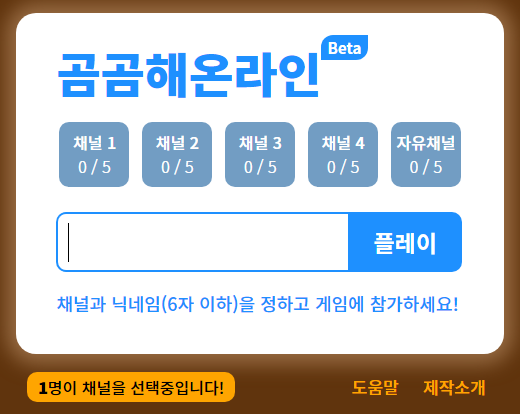

# 곰곰해온라인 (리팩토링)

- [곰곰해온라인](https://bearchain.herokuapp.com) - 초기 접속에 몇 초 정도가 소요된다
- [old version](https://github.com/zinirun/gom-gom-hae-online/tree/e2329cc9e15a5a2b55878fca3d795799b7caff84/old-version)

- 제작 동기
  - 피시방에서 게임 기다리는 시간이 너무 지루해 → 다같이 할 수 있는 웹 게임이 없을까? → 게임은 간단하고, 마음 편하게 하고싶어 → 그냥 내가 만들어볼까? → 제작 시작

## 리팩토링 프로젝트 (완료)

Node.js를 접하고 처음으로 만든 토이프로젝트 <곰곰해온라인>을 현재의 실력으로 다시 정비하고 싶었다.
- 타입스크립트 도입과 모듈화를 통해 알맞은 위치에 알맞은 코드를 넣으려고 노력했다
- 타입스크립트를 이론상으로는 많이 공부했지만, 실제 코드에 적용시키기까지는 많은 장벽이 있었다
- 기존 코드는 `app.js`에 모든 코드를 작성해서 무슨 타입이 어떻게 넘어오는지, 뭘 리턴하는지도 한참을 해석했다.

적절한 모듈화를 위해 역할에 따라 Express 서버와 Socket 통신 서버, 게임 컨트롤러를 철저하게 분리했다. 

- `App`: Express 서버를 Class화하여 소켓, 컨트롤러, 라우터, 미들웨어 등을 정의한다.
- `SocketActions`: Socket 통신의 전반을 구현하였고, 게임 컨트롤러에서 관리하는 게임 인스턴스에 접근한다.
- `GameController`: 게임 컨트롤러는 라우터의 uri를 통해 게임 인스턴스를 1개의 객체로 관리하여 게임 전반을 핸들링한다.
- `GameInstance`: 게임에 대한 모든 변수와 함수를 구현한 객체이다.

그 밖에도 별도의 인터페이스, 미들웨어가 필요했다. 한가지 못 해결한 것이 있었는데, 세션을 접근하려면 `request.session`이 `Request` 인터페이스에 있어야 하는데 기본 express 타입에는 없어서 별도로 선언했지만 적용이 되지 않아 어쩔 수 없이 `any`로 명시하게 되었다.

리팩토링에 일주일이 좀 덜 걸렸는데, 타입스크립트 도입과 모듈화를 별개로 그 때는 Promise, ES6 문법 등을 완전히 숙지하지 못한 채 시작해서 내 코드를 보는 내가 부끄러웠다. 곰곰해온라인은 나에게는 많은 의미가 있는 프로젝트였고, 나중에 현업에서 종사하면서 2차 리팩토링을 하며 그때의 또 발전된 모습을 보고 싶다.